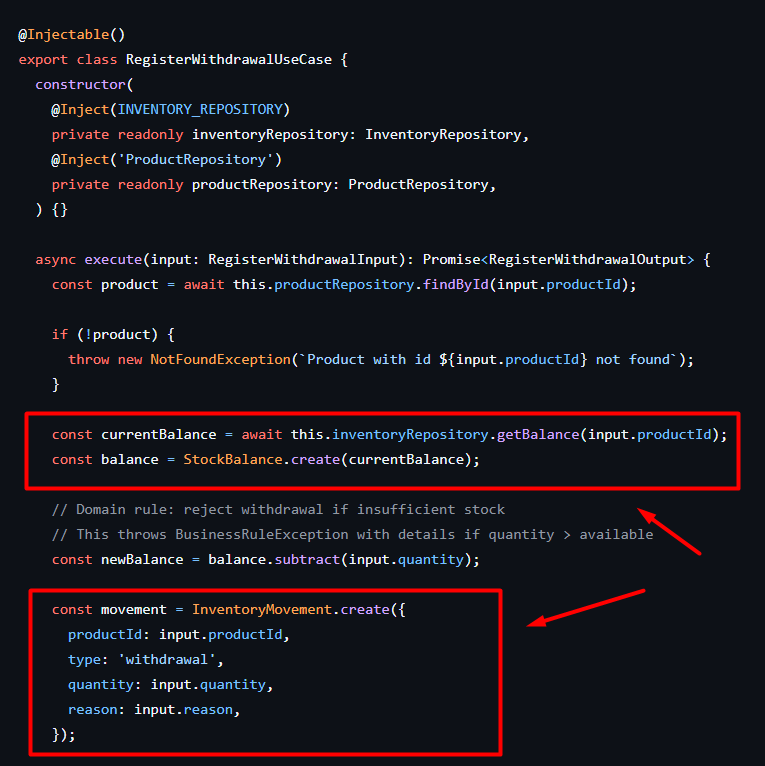
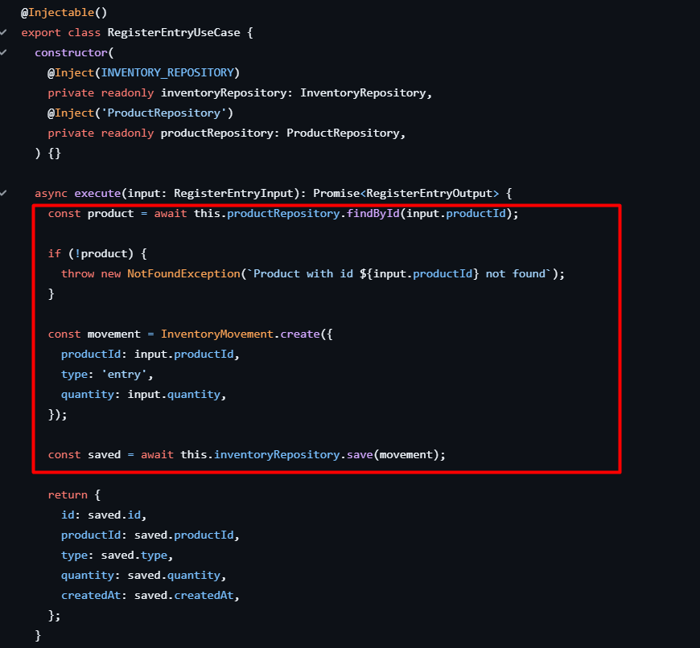
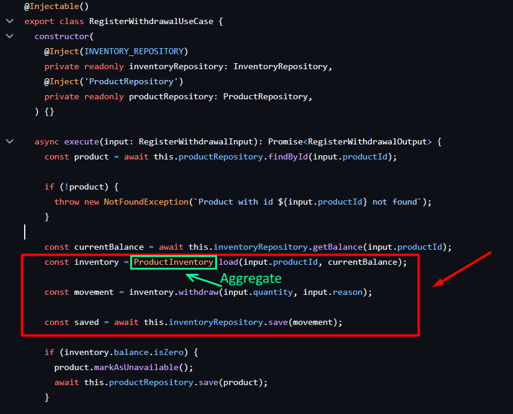
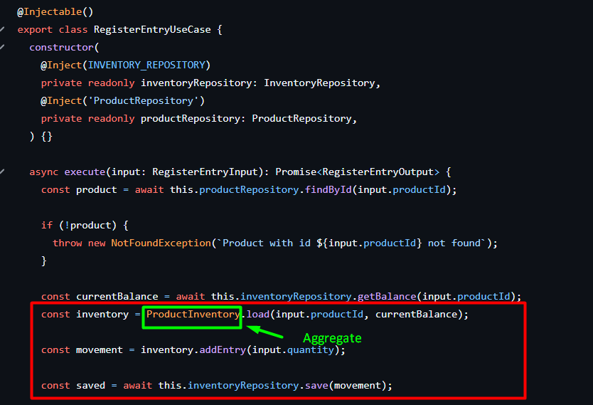

# ATV3 - Grupo 3 - Evolução orientada por evidências

## Objetivo da Melhoria

Identificamos que o módulo de Estoque sofria com o antipadrão **Anemic Domain Model** e **Regra de Domínio Espalhada entre Camadas**.

Antes dessa alteração, toda a lógica matemática de validar saldo, garantir limite de retirada e calcular o novo saldo estava implementada de forma procedural diretamente nos Casos de Uso (`RegisterWithdrawalUseCase` e `RegisterEntryUseCase`). As entidades de domínio serviam apenas como estruturas de dados.



Figura 1 – Implementação anterior da classe `RegisterWithdrawalUseCase` com regras de domínio no Caso de Uso



Figura 2 – Implementação anterior da classe `RegisterEntryUseCase` com regras de domínio no Caso de Uso

Essa abordagem concentrava responsabilidades de negócio na camada de aplicação, fazendo com que qualquer alteração nas regras de estoque exigisse modificações diretamente nos Casos de Uso. Além disso, diferentes operações poderiam acabar reproduzindo as mesmas validações, aumentando o risco de inconsistências e dificultando a manutenção do sistema.

A mudança implementada pela equipe reduziu de  forma significativa o acoplamento entre a camada de aplicação e as regras de negócio, centralizando o comportamento do estoque em um único ponto do domínio. Dessa forma, o conhecimento sobre disponibilidade de saldo, atualização do estoque e geração de movimentações deixou de estar espalhado pelos Casos de Uso e passou a ser encapsulado pelo `Aggregate`.



Figura 3 – Implementação da classe `RegisterWithdrawalUseCase` após as modificações das regras de domínio no Caso de Uso



Figura 4 – Implementação da classe `RegisterEntryUseCase` após as modificações das regras de domínio no Caso de Uso

## Melhoria Técnica

Aplicamos os conceitos de DDD introduzindo um novo **Aggregate Root** chamado `ProductInventory`.

- **O que mudou no Domínio**: O `ProductInventory` agora encapsula o `StockBalance`. É de responsabilidade exclusiva deste Agregado aprovar e processar as retiradas (`withdraw`) e entradas (`addEntry`), garantindo que o saldo nunca fique negativo e gerando a entidade `InventoryMovement`.
- **O que mudou na Aplicação**: Nossos Casos de Uso voltaram a ser apenas orquestradores limpos. Eles agora carregam o Agregado através do saldo atual do repositório, delegam a ação de retirar/adicionar para o domínio, e apenas mandam salvar a movimentação gerada.

## Testes

**Antes:** A validação de negócio de que um estoque não poderia ficar negativo era testada fazendo _mocks_ complexos no repository e forçando o Caso de Uso a fazer a conta usando o Value Object isolado.

**Depois:** Escrevemos a suíte de testes `product-inventory.aggregate.spec.ts` dedicada 100% à regra de domínio isolada de qualquer infraestrutura ou caso de uso. Ajustamos os testes da camada de aplicação (`register-entry` e `register-withdrawal`) para acomodar as delegações limpas.

**Sucesso:**
Execução da suíte completa com **100% de aprovação**:

```bash
> jest test/unit/inventory

PASS test/unit/inventory/product-inventory.aggregate.spec.ts
PASS test/unit/inventory/inventory-movement.entity.spec.ts
PASS test/unit/inventory/stock-balance.vo.spec.ts
PASS test/unit/inventory/register-entry.use-case.spec.ts
PASS test/unit/inventory/register-withdrawal.use-case.spec.ts
PASS test/unit/inventory/get-balance.use-case.spec.ts
PASS test/unit/inventory/register-withdrawal.use-case.coverage.spec.ts
PASS test/unit/inventory/register-entry.use-case.coverage.spec.ts

Test Suites: 8 passed, 8 total
Tests:       65 passed, 65 total
```

## Problema de Qualidade Atacado

O problema principal atacado foi a baixa coesao do modulo de estoque, com regra de negocio distribuida em casos de uso e risco de divergencia entre fluxos de entrada e retirada.

Em termos de qualidade de software, essa condicao gerava:

- maior chance de regressao ao evoluir regras de saldo;
- acoplamento excessivo entre aplicacao e dominio;
- testes de regra de negocio mais caros de manter;
- menor previsibilidade operacional em cenarios de erro.

## Validacoes e Tratamento de Erro

Para reforcar a robustez da entrega, o sistema ja executa validacoes em duas camadas:

- validacao de entrada via `ValidationPipe` global com `whitelist`, `forbidNonWhitelisted` e `transform`;
- validacao de regra de negocio no dominio, com rejeicao de estados invalidos (ex.: retirada sem saldo suficiente).

O tratamento de erro padronizado ocorre via filtro global de excecoes, com resposta consistente (`statusCode`, `error`, `message`, `timestamp` e `details` quando aplicavel).

## Evidencias de Seguranca

Como acao de consolidacao para o trabalho final:

- removemos bypass da auditoria de seguranca no CI (`npm audit` deixa de usar `|| true`);
- aplicamos prioridade para vulnerabilidades criticas/altas em dependencias diretas:
	- `minimist` atualizado para `1.2.8`;
	- `lodash` atualizado para `4.17.21`;
- mantivemos a verificacao de seguranca no pipeline como gate obrigatorio.

## Logs, Rastreabilidade e Observabilidade

Foram consolidadas evidencias de observabilidade:

- logs estruturados JSON por request (metodo, rota, status e duracao);
- endpoint de health (`/health`) para verificacao rapida de disponibilidade;
- endpoint de metrics (`/metrics`) em formato compativel com scraping;
- ativacao do tracing no bootstrap para rastreabilidade de execucao.

## Melhoria de Operacao

No pipeline CI/CD, os gates foram endurecidos para evitar aprovacao superficial:

- lint passou a executar em modo verificacao (`lint:check`), sem autofix silencioso;
- cobertura minima agora falha o job quando abaixo do limiar;
- auditoria de seguranca sem bypass.

Essas mudancas reduzem risco operacional e aumentam confiabilidade do processo de entrega.

## Reducao de Divida Tecnica

A centralizacao das invariantes no agregado `ProductInventory` reduz duplicacao de regra, facilita evolucao segura e melhora a clareza arquitetural entre dominio, aplicacao e infraestrutura.

## Evidencias de Execucao (Consolidado)

Comandos executados localmente para comprovacao:

```bash
npm run build
npm run lint:check
npm run test:unit
npm run test:property
npm run test:integration
npm run test:coverage
npm audit --omit=dev --audit-level=high
```

Resumo esperado para a entrega:

- build bem-sucedido;
- suites de testes unitarios, property e integracao aprovadas;
- cobertura acima do minimo definido no pipeline;
- auditoria sem vulnerabilidades criticas/altas nas dependencias de producao.

## Texto sugerido para descricao do Pull Request

- O que foi melhorado:
	- refatoracao do modulo de estoque para concentrar regra no agregado de dominio;
	- endurecimento dos gates de qualidade no CI;
	- ativacao de tracing no bootstrap;
	- atualizacao de dependencias com foco em seguranca.
- Problema de qualidade atacado:
	- anemic domain model e regra de negocio espalhada, com impacto em manutencao e risco de inconsistencia.
- Testes/evidencias:
	- execucao de build, lint, testes (unit/property/integration/coverage) e auditoria de seguranca.
- Impacto esperado:
	- maior confiabilidade para evolucao, operacao e manutencao do sistema.
